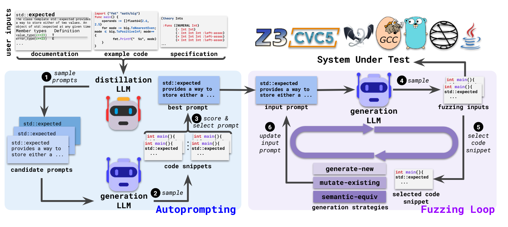

# 运行说明
先简单且快速的过一遍这个东西的运行方法。

## 环境搭建
按照requirement.txt下载，运行过程中肯定还有一些别的库没下载，查漏补缺的下就行。

**原仓库其实给了一个完整版的Docker，如果本机算力够ollama的可以直接用那个试试，估计会简单些，服务器本身就是一个Docker（应该）所以我就没试再套一层**

这里选择ollama的starcoder2-7B模型，在实验室服务器上没法直接挂梯子，所以得**走一个共享网络连接本机的VPN**来下载并运行模型。
>ssh -vvv -N -R 7890:localhost:7890 -p 40624 root@172.28.7.23

路由器固件的架构和服务器的架构不同，一个时MIPS一个时x86，fuzz4all没法直接用原本的逻辑去运行固件，所以需要使用qemu仿真（但是仿真后也不是直接对其进行了测试，估计还要再做魔改），仿真的方法我直接按GPT给的走的，没有特别记，不是很麻烦。

项目本身给的demo是一个/gcc-13/bin/g++，想试的话需要使用源码下载gcc-13，到这里跑通这个代码问题就不大了，下面看看代码逻辑。

# 代码逻辑
