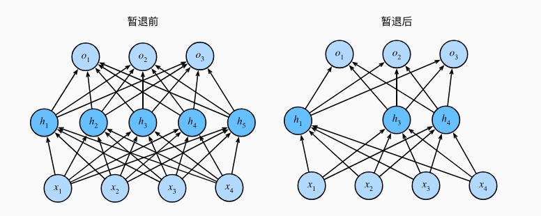

# 模型训练
## 过拟合和欠拟合
过拟合就是在训练数据集上训练的“太好”，而不适用于其他的大型真实数据集。
即如果有足够多的神经元、层数和训练迭代周期， 模型最终可以在训练集上达到完美的精度，此时测试集的准确性却下降了。

欠拟合就是训练误差和验证误差都比较大而且二者之间的差距很小，这就代表模型的表达能力不足，仍需要训练一个更复杂的模型。

## 训练误差和泛化误差
训练误差（training error）是指， 模型在训练数据集上计算得到的误差。 泛化误差（generalization error）是指， 模型应用在同样从原始样本的分布中抽取的无限多数据样本时，模型误差的期望。

泛化误差是无法被精确计算出来的，因为无限多数据样本不可能供我们使用，这是一个虚拟的对象，因此只能用一个独立的测试机来估计。

## 模型复杂性
这是一个比较难定义的东西，可能是参数更多的模型更复杂，也可能是迭代更多次的模型更复杂，也会是训练样本的数量越大越复杂。

## 验证集&测试集
二者之间的关系非常模糊，因为理论上我们希望测试集能一下测试完模型的误差，这样就能保证独立同分布，但是在实际操作中，因为模型需要不断迭代，每一轮都要用测试集来更新，因此验证集这个概念就被提出，但是他俩还是很难界定，教程里的准确度都用验证集准确度测定。

## K折交叉验证
把原始训练数据分为K个不重叠的子集，执行K此训练和验证，每次在K-1个子集上进行训练，在剩余的一个子集上验证，最后对K次实验结果取平均来估计误差。

## 权重衰减
一种正则化技术 (${L^2}$ 正则化,又叫岭回归算法)。

这种算法对权重向量的大分量做出巨大惩罚，使得我们的学习算法偏向于大量特征上更均匀分布的权重的模型。而${L_1}$算法则是会把权重集中在一小部分特征上，而把其他的权重清为0，这是特征选择。

为啥是权重衰退呢，首先加上罚项之后，计算梯度时应该是：

$\frac{\partial}{\partial w} \left( \ell(w, b) + \frac{\lambda}{2} \|w\|^2 \right) = \frac{\partial \ell(w, b)}{\partial w} + \lambda w$

根据权重更新的计算公式，有

$\mathbf{w}_{t+1} = \mathbf{w}_t - \eta \frac{\partial}{\partial\mathbf{w_t}}$

等于是

$\mathbf{w}_{t+1} = (1-\eta\lambda)\mathbf{w}_t - \eta\frac{\partial\mathcal{E}(\mathbf{w}_t, b_t)}{\partial\mathbf{w}_t}$

$\eta\lambda$一般是小于1的，每次都把$\mathbf{w}_t$放小一次，因此叫做权重衰减

## 暂退法 
训练过程中，在计算后续层之前向网络的每一层注入噪声，当训练一个有多层深层网络时，注入噪声只会在输入-输出映射上增加平滑性，这就是暂退法。


如图，隐藏层的单元有p的概率会被丢弃，余下的保留

# 模型优化
## 梯度爆炸和消失
当神经网络层数比较大时，层数${L}$的神经网络的梯度是一个${L-1}$层矩阵与梯度向量的乘积，这样数值就会发生较大的变化，包括梯度爆炸和消失。

要么是梯度爆炸的问题：当参数更新过大， 破坏了模型的稳定收敛； 要么是梯度消失（gradient vanishing）问题： 参数更新过小，在每次更新时几乎不会移动，导致模型无法学习。

## 权重初始化
在一个合理的区间随机初始化参数，训练开始的时候更容易有数值不稳定，因为原理最优解的地方损失函数表面可能很复杂（这里想象爬山的山坡），而最优解的附近表面会比较平滑。

选择合理的权重初始值和激活函数可以提高数值稳定性。

```py
import os
from openai import OpenAI
from anthropic import Anthropic
import google.generativeai as genai

# ========================
# 固定模型配置（按你要求）
# ========================
MODELS = {
    "1": {"name": "GPT-5", "provider": "openai", "model": "gpt-5"},
    "2": {"name": "Gemini 2.5", "provider": "google", "model": "gemini-2.5"},
    "3": {"name": "Claude 3.7", "provider": "anthropic", "model": "claude-3.7"},
    "4": {"name": "Grok 3", "provider": "xai", "model": "grok-3"},
}

# ========================
# API 客户端初始化
# ========================
clients = {}
if os.getenv("OPENAI_API_KEY"):
    clients["openai"] = OpenAI(api_key=os.getenv("OPENAI_API_KEY"))
if os.getenv("ANTHROPIC_API_KEY"):
    clients["anthropic"] = Anthropic(api_key=os.getenv("ANTHROPIC_API_KEY"))
if os.getenv("GOOGLE_API_KEY"):
    genai.configure(api_key=os.getenv("GOOGLE_API_KEY"))
    clients["google"] = genai
if os.getenv("XAI_API_KEY"):
    clients["xai"] = OpenAI(api_key=os.getenv("XAI_API_KEY"),
                            base_url="https://api.x.ai/v1")

chat_history = []


def ask(provider, model, message):
    """统一对话方法"""
    chat_history.append({"role": "user", "content": message})

    if provider in ["openai", "xai"]:
        res = clients[provider].chat.completions.create(
            model=model,
            messages=chat_history,
        )
        reply = res.choices[0].message.content

    elif provider == "anthropic":
        res = clients["anthropic"].messages.create(
            model=model,
            max_tokens=2000,
            messages=chat_history,
        )
        reply = res.content[0].text

    elif provider == "google":
        g_messages = [{"role": m["role"], "parts": [{"text": m["content"]}]} for m in chat_history]
        model_obj = clients["google"].GenerativeModel(model)
        res = model_obj.generate_content(g_messages)
        reply = res.text

    chat_history.append({"role": "assistant", "content": reply})
    return reply


# ========================
# 聊天入口
# ========================
print("====== 选择模型 ======")
for k, v in MODELS.items():
    print(f"{k}. {v['name']}")

choice = input("请选择模型编号：").strip()
config = MODELS.get(choice)
provider = config["provider"]
model = config["model"]

print(f"\n✅ 已选择: {config['name']} ({provider})\n开始对话！（输入 exit 退出）\n")

while True:
    msg = input("你：")
    if msg.lower() == "exit":
        print("👋 再见")
        break
    try:
        ans = ask(provider, model, msg)
        print("AI:", ans)
    except Exception as e:
        print("❌ API 异常：", e)

```