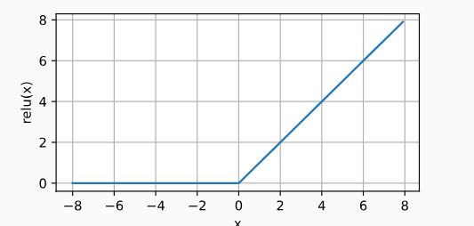

# 多层感知机是什么
## 隐藏层
前面说的线性模型是基于线性假设进行的，但是单纯的线性在真实世界里往往是不合理的，例如通过像素作为特征判断猫和狗，但是图片翻转后猫和狗仍不变，但像素特征改变，因此我们需要加一个或多个**隐藏层**来克服线性模型的限制，这就是**多层感知机（MLP）**
 
如图，该多层感知机有4个输入，3个输出，5个隐藏单元，中间是全连接层。（层数为2，是全连接的，因为输入层不涉及运算）
## 线性到非线性
看上面的单层隐藏层的感知机，隐藏层其实就是加了一个隐藏层权重 ${W^1}$ 和隐藏层偏置${b^1}$,输出到输出层时把隐藏层的结果乘上输出层权重和偏置${W^2,b^2}$。

也就是说加了隐藏层和没加差不多，毕竟我们可以通过合并隐藏层让 ${W = W^1 * W^2}$，${b = b^1 * W^2 + b^2}$来表示，那我们的多层架构就没有了任何意义，所以我们需要再仿射变换之后对每个隐藏单元应用非线性的激活函数 ${\sigma}$，激活函数的输出称为活性值。 加入了激活函数之后，多层感知机就不会退化成线性模型。

${H^{(1)} = \sigma_1(XW^1+b^1)}$ ，${H^{(2)}=\sigma_2(H^{(1)}W^2 +b^2)}$

## 激活函数
ReLU函数，以0为活性值，仅保留正元素并丢弃所有负元素。

```py
x = torch.arange(-8.0, 8.0, 0.1, requires_grad=True)
y = torch.relu(x)
d2l.plot(x.detach(), y.detach(), 'x', 'relu(x)', figsize=(5, 2.5))
```


该函数输入为负则导数为0，否则导数为1，输入0时不可导但使用0作为其导数，他的求导表现要么让参数消失，要么让参数通过，减轻了神经网络的梯度消失问题。

sigmoid函数则是将输入变换为区间（0，1）上的输出：
$${sigmoid(x) = \frac{1}{1+exp(-x)}}$$
sigmoid和我们前面学的softmax很像，可以看成是softmax的特例。但他在隐藏层中已经很少使用，一般都使用更简单的ReLU，sigmoid更多用来控制时序信息流的架构。

当输入接近0时，sigmoid函数接近线性变换。


其导数图像如下图：

当输入为0时，sigmoid函数的导数达到最大值0.25； 而输入在任一方向上越远离0点时，导数越接近0。

sigmoid图像长得跟tanh很像，只是tanh关于原点对称。

# 如何实现多层感知机
仍旧以Fashion-MNIST数据集为例，把图像视为784个特征和10个类的简单分类数据集，实现一个单隐藏层多层感知机，隐藏单元为256个。

```py
import torch
from torch import nn
from d2l import torch as d2l
batch_size = 256
train_iter , test_iter = d2l.load_data_fashion_mnist(batch_size)

num_inputs,num_outputs,num_hiddens = 784,10,256
W1 = nn.Paramter(torch.randn(
    num_inputs,num_hiddens,requires_grad = True)*0.01)
b1 = nn.Parameter(torch.zeros(num_hiddens, requires_grad=True))
W2 = nn.Parameter(torch.randn(
    num_hiddens, num_outputs, requires_grad=True) * 0.01)
b2 = nn.Parameter(torch.zeros(num_outputs, requires_grad=True))

params = [W1, b1, W2, b2]
```
写一个ReLU函数
```py
def relu(X):
    a = torch.zeros_like(X) #与X形状相同的向量a
    return torch.max(X, a)
```
网络则是直接把二维图像转换过来即可

```py
def net(X):
    X = X.reshape((-1,num_inputs))
    H = relu(X@W1 + b1)
    return (H@W2 + b2)
```
训练过程就比较简单，把迭代周期设置为10，学习率调整为0.1
```py
loss = nn.CrossEntroptLoss(reduction = 'none')
num_epochs, lr = 10, 0.1
updater = torch.optim.SGD(params, lr=lr)
d2l.train_ch3(net, train_iter, test_iter, loss, num_epochs, updater)
```
# 简洁实现
与上一章写的softmax相比，我们这只是添加了两个全连接层（一个隐藏层一个输出层），并使用了ReLU激活函数。
```py
net = nn.Sequential(nn.Flatten(),
                    nn.Linear(784, 256),
                    nn.ReLU(),
                    nn.Linear(256, 10))

def init_weights(m):
    if type(m) == nn.Linear:
        nn.init.normal_(m.weight, std=0.01)

net.apply(init_weights)

batch_size, lr, num_epochs = 256, 0.1, 10
loss = nn.CrossEntropyLoss(reduction='none')
trainer = torch.optim.SGD(net.parameters(), lr=lr)

train_iter, test_iter = d2l.load_data_fashion_mnist(batch_size)
d2l.train_ch3(net, train_iter, test_iter, loss, num_epochs, trainer)
```