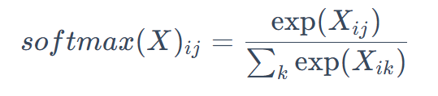
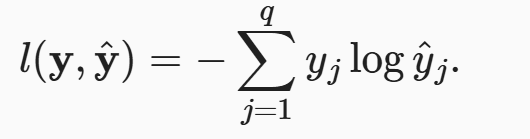

# Softmax回归
## 从零实现
### 初始化
这里使用的Fashion-MNIST数据集图像为28*28，文中视为一个展平的向量，把每个像素看作一个特征。

Softmax的输出与判定的类别是**一样多的**，因此构筑成784\*10的矩阵，偏置${b}$应该是1\*10的向量，把权重W用正态分布初始化，把偏置用0初始化。

``` python
num_inputs = 784 #输出维度
num_outputs = 10 #输入维度

W = torch.normal(0,0.01,size=(num_inputs,num_outputs),requires_grad = True)
b = torch.zeros(num_outputs,requires_grad = True)
```
> normal用于使用正态分布标准化变量，规定向量维度，requires_grad表示需要记录梯度，便于反向传播求导

### 定义Softmax

Softmax由三步组成：
- 对每个项求幂
- 对每一行求和，得到每个样本的规范化常数
- 对每一行除以规范化常数，确保结果和为1
  
 




于是我们根据上述步骤规定：
```python
def softmax(X):
    X_exp = torch.exp(X)
    partition = X_exp.sum(1, keepim = True) #轴1是行，0是列
    return X_exp / partition
```

### 定义模型 
模型，对应的就是输入如何通过映射到输出，这里我们是把像素点当作特征，那么我们就用reshape将原始图像转为向量。

```py
def net(X):
    return softmax(torch.matul(X.reshape((-1,W.shape[0]),W)+b))
```

### 定义损失函数
使用交叉熵损失函数来进行定义损失。我们先创建一个数据样本y_hat，包含2个样本在3个类别的预测概率，以及对应的标签y。我们规定标签y在第一个样本中，第一类是正确的预测； 而在第二个样本中，第三类是正确的预测。然后使用y作为y_hat中概率的索引， 我们选择第一个样本中第一个类的概率和第二个样本中第三个类的概率。

```python
y = torch.tensor([0, 2])
y_hat = torch.tensor([[0.1, 0.3, 0.6], [0.3, 0.2, 0.5]])
y_hat[[0, 1], y]
```
>这里用到了高级索引，y_hat[[0, 1], y] 相当于“从第0行取第 y[0] 个元素，从第1行取第 y[1] 个元素”

下面我们定义交叉熵损失：

```py
def cross_entropy(y_hat, y):
    return - torch.log(y_hat[range(len(y_hat)), y])
```
交叉熵损失为：


### 分类精度
我们上面已经给出了y_hat的预测分类，下面要看分类的精度如何。

```py
def accuracy(y_hat, y):  
    """计算预测正确的数量"""
    if len(y_hat.shape) > 1 and y_hat.shape[1] > 1: #如果是高纬，就取最大值作为下标判断类别
        y_hat = y_hat.argmax(axis=1)
    cmp = y_hat.type(y.dtype) == y #比较是否相等
    return float(cmp.type(y.dtype).sum()) #返回相等的个数
```
下面判断在整个数据集上评估模型的准确率：
```py
def evaluate_accuracy(net,data_iter):
    if isinstance(net,torch.nn.Moudle):
        net.eval() #把模型设置为评估模式，关闭dropout，batchnorm等训练行为
    metric = Accumlator(2) #正确预测数、预测总数
    with torch.no_grad():
        for X,y in data_iter:
            metric.add(accuracy(net(X),y),y.numel())
    return metric[0] / metric[1]
```
这里的Accumulator是
```py
class Accumulator:  #@save
    """在n个变量上累加"""
    def __init__(self, n):
        self.data = [0.0] * n

    def add(self, *args):
        self.data = [a + float(b) for a, b in zip(self.data, args)]

    def reset(self):
        self.data = [0.0] * len(self.data)

    def __getitem__(self, idx):
        return self.data[idx]
```
用于对多个变量进行累加,我们在Accumulator实例中创建了2个变量， 分别用于存储正确预测的数量和预测的总数量。 当我们遍历数据集时，两者都将随着时间的推移而累加。

### 训练
```py
def train_epoch_ch3(net, train_iter, loss, updater):  #@save
    """训练模型一个迭代周期（定义见第3章）"""
    # 将模型设置为训练模式
    if isinstance(net, torch.nn.Module):
        net.train()
    # 训练损失总和、训练准确度总和、样本数
    metric = Accumulator(3)
    for X, y in train_iter:
        # 计算梯度并更新参数
        y_hat = net(X)
        l = loss(y_hat, y)
        if isinstance(updater, torch.optim.Optimizer):
            # 使用PyTorch内置的优化器和损失函数
            updater.zero_grad()
            l.mean().backward()
            updater.step()
        else:
            # 使用定制的优化器和损失函数
            l.sum().backward()
            updater(X.shape[0])
        metric.add(float(l.sum()), accuracy(y_hat, y), y.numel())
    # 返回训练损失和训练精度
    return metric[0] / metric[2], metric[1] / metric[2]
```

## 简洁实现
```py
import torch
from torch import nn
from d2l import torch as d2l

batch_size = 256
train_iter, test_iter = d2l.load_data_fashion_mnist(batch_size)
# PyTorch不会隐式地调整输入的形状。因此，
# 我们在线性层前定义了展平层（flatten），来调整网络输入的形状
net = nn.Sequential(nn.Flatten(), nn.Linear(784, 10))

def init_weights(m):
    if type(m) == nn.Linear:
        nn.init.normal_(m.weight, std=0.01)

net.apply(init_weights);
loss = nn.CrossEntropyLoss(reduction='none')
trainer = torch.optim.SGD(net.parameters(), lr=0.1)
num_epochs = 10
d2l.train_ch3(net, train_iter, test_iter, loss, num_epochs, trainer)
```