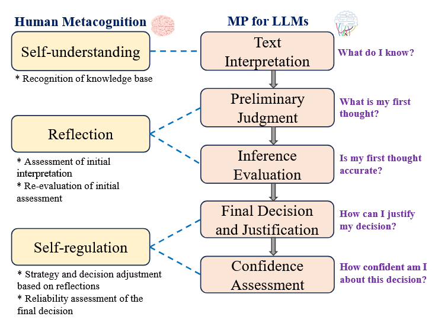
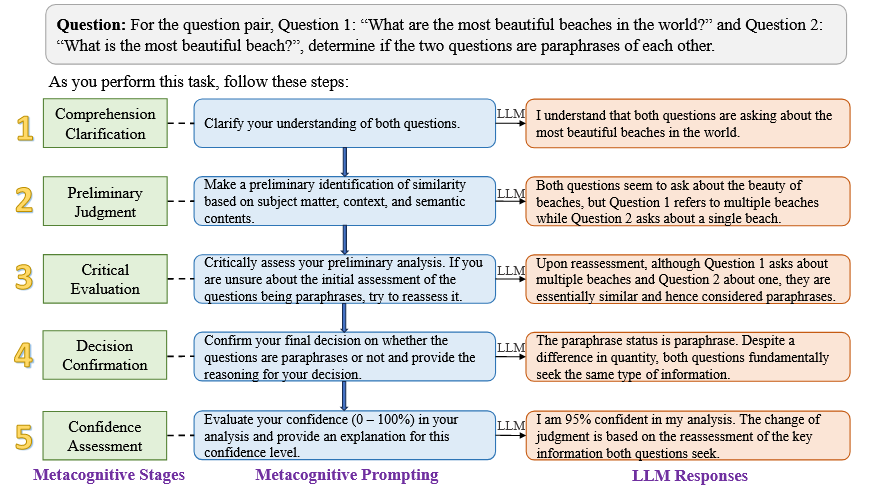
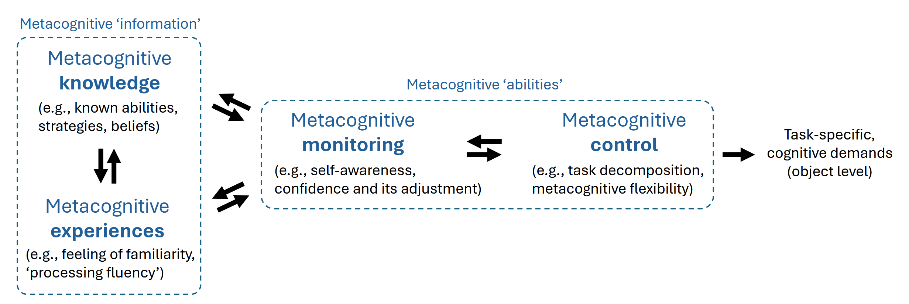
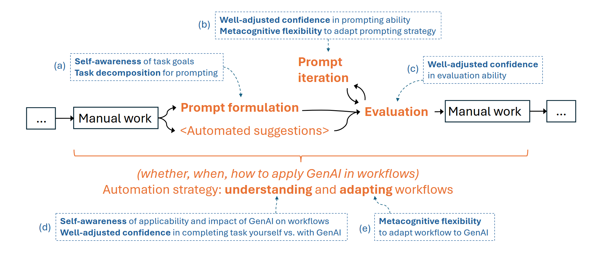

# 元认知是什么
**元认知(Metacognition)** 由美国心理学家*John H. Flavell* 定义，是对一个人的思维过程的认知和对其背后模式的理解。*meta* 这一词根的意思就是“超越”。

其被定义为一个人关于自己的认知过程及结果或其他相关事情的知识，以及为完成某一具体目标或人物，依据认知对象对认知过程进行主动的监测以及连续的调节。通常元认知有两个部分：（1）认知概念（2）认知调节系统。

简而言之，元认知就是**对自己思考过程的认知与理解和调节**，也就是**对认知的认知**

# 论文阅读
## 论文1：元认知prompting提高大模型理解力（NAACL-HLT）
### 研究背景
在LLM里，受有效提示设计的影响，任务的特定性表现一直在进步。近期的提示词工作已经增强了LLM的逻辑密集型任务推理能力，但是对细微差异的理解尤其是对处理和解释复杂信息至关重要的信息，还没有得到充分研究。在此背景下，作者引入了元认知提示Metacognitive Prompting（MP），并且在llama，PaLM2，GPT-3.5和GPT-4上做了实验，在GLUE、SuperGLUE、BLUE和LexGLUE基准测试的十个自然语言理解（NLU）数据集上进行测试。

简单增加模型规模不一定能增加理解和推理能力。深入研究提示词带来的收益媲美微调，且增加样本效率。

### 从人到LLM

* LLM解释提供的文本，即人类的理解阶段
* 模型进行初步判断解释，即人类基于信息产生判断的阶段
* 模型进行自我反思，进行批判性评估
* 反思之后进行决策，阐述其推理依据
* 评估可信性（信心）

### 总结
本篇论文主要就是讲了怎么通过认知方法来提高大模型的理解能力，主要工作是给LLM配置一个模拟自我反思认知的过程。
本文样例：
> 例1：Zero-shot MP Template

* In two sentences, sentence 1: “[sentence_1]” and sentence 2: “[sentence_2]”, both contain the target word “[word]”. Determine if the target word is used with the same meaning in both sentences. As you perform this task, follow these steps:
1. Understand the context and meaning of the target word in both sentences.
2. Make a preliminary judgment on whether the target word has the same meaning in both sentences.
3. Critically assess your preliminary analysis. If you are unsure about your initial judgment, reassess it.
4. Confirm your final answer and explain the reasoning behind your decision.
5. Evaluate your confidence (0-100%) in your analysis and provide an explanation for this confidence level.

> 例2：Few-shot MP Demonstration
* In two sentences, sentence 1: “The washing machine won’t go unless it’s plugged in.” and sentence 2: “The day went well until I got your call.”, both contain the target word “go”. Determine if the target word is used with the same meaning in both sentences.
1. In sentence 1, “go” refers to the operation of the washing machine. In sentence 2, “went” (a form of “go”) refers to the progression of the day.  
2. Initially, “go” in the first sentence seems to be about mechanical operation, while in the second, it’s about the passage of time or events.  
3. Reflecting further, the contexts clearly differentiate the meanings: one deals with machinery and its function, the other deals with the experience of a day. 
4. The target word “go” does not have the same meaning in both sentences. In the first, it pertains to operation, and in the second, to the progression of events.  
5. I am 83% confident in this analysis. The term “go” is used in different contexts in the two sentences, leading to different meanings.

## 论文2：生成式人工智能的元认知需求与机遇（ACM CHI‘24）
### 研究背景
生成式人工智能在提示词、评估和以来输出以及优化工作流程方面面临挑战。作者认为元认知监控一个人的思想和行为的心理能力，能为理解和设计这些可用性提供有价值的帮助，并且最近的生成式人工智能用户研究里说明了生成式AI如何对用户施加元认知需求，需要高度的元认知监控和控制。

作者提出，提供把元认知支持策略集成到生成式人工智能系统中来针对可解释性和可定制性来满足这些需求，并说明这是推进人机交互进步的新颖的研究和设计方向。

> 原文：we suggest that current GenAI systems impose multiple metacognitive demands on users; understanding these demands can help interpret and probe the identified and potentially novel usability challenges. Secondly, we suggest that the perspective of metacognitive demands offers new research and design opportunities for human-AI interaction. 

LLM对用户有着元认知需求。这种需求就像经理把任务委派给团队，经理需要清楚的理解并且制定团队的目标，把目标分解为可沟通的任务，评估团队的产出质量并且在此过程中相应的调整计划；此外他们需要决定是否、何时以及如何委派这些任务，这些能力涉及对一个人的思维过程和行为的元认知监控和控制。

### 做了什么
通过可以集成到GenAI系统中的元认知支持策略来提高用户的元认知，包括帮助用户进行规划、自我评估和自我管理的策略，通过一定的设计把元认知处理从用户转到系统，即降低对用户的元认知能力要求。

本文贡献：
*  We conceptualize and ground the usability challenges of GenAI in an understanding of human metacognition, drawing on research from psychological and cognitive science and recent GenAI user studies. 
*  We draw from research on metacognitive interventions, GenAI prototypes, and human-AI interaction to propose two directions for addressing the metacognitive demands of GenAI: improving users’ metacognition, and reducing the metacognitive demands of GenAI. 
*  We use the metacognition lens to identify the need—and concrete directions—for further research into the metacognitive demands of GenAI, and design opportunities that leverage the unique properties of GenAI to augment system usability.
*  定义好了概念、提出了解决 GenAI 元认知需求的两个方向：提高用户的元认知，以及降低 GenAI 的元认知需求、进一步研究 GenAI 元认知需求和具体方向，并设计利用 GenAI 的独特属性来增强系统可用性（说实话没有很理解什么意思）
  
### 本文提出的元认知框架：

分为元认知知识和元认知经验，这是理解自己认知的两种不同信息来源，以及监控和控制的元认知能力，通过这种能力，人们可以评估和指导自己的认知。

**元认知知识**是明确的，包括人们对自己的策略、推理能力、决策和信念等方面的有意识理解。
**元认知经验**包括人们可以直接感受的任何事情，并且可以是隐式的，包括主观感受，例如熟悉的感觉，或在阅读时误解了段落的感觉，以及提供有关认知处理信息的其他隐含线索。

知识和经验二者是互相关联的，经验有助于认知知识（例如，当解决问题过程中的困难感被编码为一个人不擅长解决问题的知识时）。知识也是一种元认知经验（在经历一种困难的感觉时记得自己解决问题的能力很差）

**元认知监控**是对自己思维的评估，而 **元认知控制** 则是直接指导自己的思维能力。二者也是互相关联的。

### 生成式人工智能在简化的用户工作流程中的每个点提出的元认知需求

### 总结
这篇主要是做人机交互方面的研究，目的是尽量降低LLM对用户的元认知要求，主要目标没有什么参考性，只需要关注他们对LLM的元认知理解。

## 论文3：通过有说服力的对话调查LLM对错误信息的信念
### 背景
在多轮对话中，尤其是有说服力的对话中，LLM的信念可能会发生变化，即LLM可以高度接受外部证据，即使与它们的记忆冲突。而且LLM更倾向于调整自己的答案，甚至遵循客观上错误的观点。
之前的工作主要集中在单论对话中，但是一个人的信念是可以通过说服来改变的，说服过程当然可以包含多轮对话。
### 